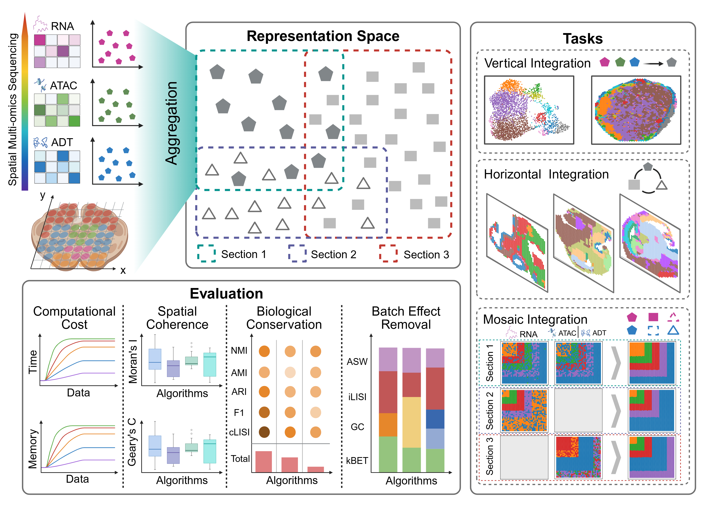

# SMOBench
Benchmarking algorithms for spatial multimodal omics integration
## Framework

## Dataset
The dataset can be found in https://drive.google.com/file/d/1XPmGicNOeaKjMnMGqvMPD3HLIBy8ostX/view?usp=drive_link
## Usage
Our experiments were all processed on a PBS cluster. The running scripts can be found in the subfolders of each method. The visualization code in `/Draw/`, the metrics calculating code in `/Eval/`.
